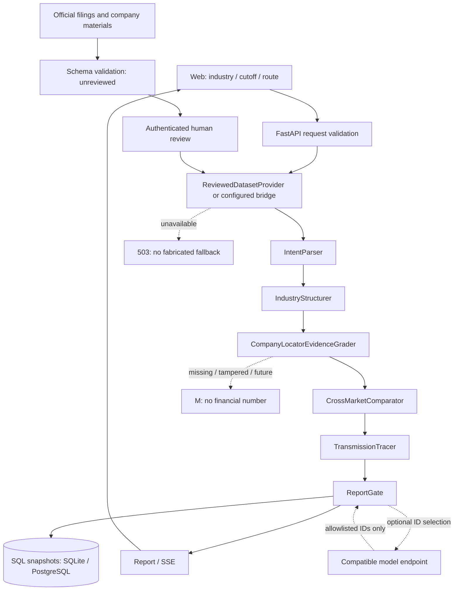

# Spec: 产业链 AI 研究终端

版本：0.2.0；日期：2026-10-09；产品名：ChainScope。本文是当前实现与后续开发的接口规范，不将计划功能表述为已完成能力。

## 1. 目标与交付范围

为券商行研人员、机构投资者提供一个持续更新的研究工作台：先定义产业分类与技术口径，再核对公司归属证据，解释中外可比关系，并将外部情景追踪到业务与财务观察指标。

首版仅覆盖**固态电池**，同时把全固态、半固态、固态隔膜、凝聚态标为不同路径。分类口径为研究者维护的价值链功能分类，不声称是交易所或数据商的官方分类。

| 验收事项 | 当前交付 | 验证方式 |
|---|---|---|
| 产业分类、层级、公司归属 | 五个环节、四条有向边、六家公司、七条关系 | 页面筛选、接口与数据合同测试 |
| 有收入到计划/无证据的可信度 | A/B/C/D + 独立 M 状态；按关系评级 | 同公司不同关系、缺财务字段、未来证据测试 |
| 中外公司为何可比/不可比 | 赣锋与 QS；Solid Power 与出光 | 查看技术、客户/合作方、模式、口径限制及来源 |
| 外部变化传导 | 原料降价、量产延期、关税假设三个情景 | 分支包含业务影响、指标、条件、反向机制 |
| 可操作 Web 与源码 | 托管独立演示版；完整本地后端与前端 | 独立模式/后端模式分别核验 |
| 持续更新 | 新证据导入→待审→人工复核→重新评级→快照 | 幂等导入、审核前后级别及快照测试 |
| 交付辅助材料 | README、测试与 AI 记录、演示视频 | 见 docs 与交付清单 |

### 当前运行方式

- 本地完整版：FastAPI + 真正的 Python LangGraph `StateGraph`；SQLAlchemy 持久化；默认 SQLite 零配置；提供 PostgreSQL Compose 配置。
- 托管独立演示版：静态 Web + 浏览器规则引擎；证据、审核记录和快照保存在当前浏览器。不运行 Python，不冒充在线多智能体或实时金融 API。
- 未配置在线模型时，LangGraph 节点以确定性规则执行。配置兼容模型后，模型只选择和排序已核验的证据 ID，事实文本由本地记录重建。
- 当前没有扶摇/iFinD 凭据或可调用工具。实际使用的是题目允许的官方公开材料，不虚构专有 API、公告编号或请求记录。

## 2. 数据流与系统边界

请求 → 参数校验 → 数据提供方 → 意图解析 → 分类口径 → 公司实体与业务关系 → 证据门控 → 可比分析 → 传导情景目录 → 报告门控 → SQL 快照 → Web。

图的唯一架构源文件为 `docs/architecture.mmd`。代码节点名称以该文件为准；不用第二份手绘架构替代。



原始材料的自动抓取、OCR、研报付费内容解析、实时行情、全市场发现与自动下单不在本轮边界内。网页不接受任意 URL 抓取，后端桥接 URL 只从管理员环境配置读取。

### 时间口径

- `published_at`：原材料发布日。是否可用于某次研究，以它与 `as_of` 比较。
- `period`：财务归属期间，首版支持日历年度 `YYYY` 与季度 `YYYYQn`。期间结束不能晚于材料发布日期或证据截止日。
- `retrieved_at`：本次取得/核对材料的日期，不冒充原材料发布日。
- `reviewed_at`：人工复核日期，不意味着原文内容是当前最新。
- `stale`：本样本材料发布距今超过 365 天时提示跟进。365 天为**可调整假设**，不改变历史证据等级。

当前材料覆盖截止为 **2025-03-01**，2026-10-09 核对官方来源。界面默认研究这一历史快照；新材料必须显式导入与复核。

## 3. 实体、关系与证据合同

`Company` 保存稳定 `id`、名称、市场与证券代码，不按公司名称模糊匹配后直接合并。一个主体可有多个代码，但不会重复计为两家公司。新增实体需要维护登记表；首版不自动猜测新公司身份。

关系的最小作用域：`company_id × node_id × route × as_of`。每条关系有稳定 `id` 与 `evidence_ids`。同一家 Solid Power 在技术服务环节可为 A，在电解质研发环节仍是 B；不能把前者的收入证据迁移到后者。

每条证据至少包含：

```json
{
  "id": "e-sldp-revenue",
  "company_id": "sldp",
  "node_id": "process",
  "route": "all_solid",
  "title": "Solid Power 2024 Form 10-K",
  "url": "https://www.sec.gov/Archives/edgar/data/1844862/000155837025001874/sldp-20241231x10k.htm",
  "published_at": "2025-02-28",
  "kind": "revenue",
  "source_type": "annual_report",
  "locator": "Item 7 · Revenue（年报第 36 页）",
  "summary": "仅保存经过核对的客观摘要",
  "summary_hash": "sha256(summary utf-8)",
  "review_status": "reviewed",
  "revenue_amount": 11800000,
  "currency": "USD",
  "period": "2024",
  "revenue_scope": "固态电池产线安装与技术转移服务"
}
```

示例数字约 1,180 万美元来自该年报 Item 7 Revenue，金额本身经过四舍五入；不代表电芯量产收入。`revenue_share` 固定为 `null`，没有同口径分母就不推算占比。

`summary_hash` 只证明本地摘要未被修改，**不证明远程原文真实性或完整性**。引用需提供原始 URL、章节/页码、发布时间；获得数据商授权后，应另外保存原始公告编号、provider request ID 和不可变原始响应。

## 4. 证据评级与原子结论门控

| 等级 | 硬条件 | 不能解释为 |
|---|---|---|
| A 实现收入 | 官方财报；同主体、环节、路径；已结束期间；正的有限金额、币种、业务范围齐全 | 量产成熟、收入占比、未来收入或投资价值 |
| B 研发/产线 | 已核对官方研发、送样、中试、在建/产线进展 | 已实现独立收入、产能已满产 |
| C 计划/表态 | 官方未来计划或表态；没有此关系的更强材料 | 已兑现投产、订单或营收 |
| D 市场传闻 | 有可定位传闻，但无官方实质业务证据 | 支持公司真实归属的事实 |
| M 数据缺失 | 没有通过门控的同口径证据，或存在冲突待复核 | 零收入、没有研发、没有业务 |

处理顺序：

1. 校验证据 ID、公司实体、环节与技术路径一致。
2. 校验 HTTPS 官方来源、定位字段、摘要哈希和人工审阅状态。
3. 过滤发布日期晚于 `as_of` 的证据。
4. 保留冲突并返回 `decision=conflicted`，不选择性隐藏反证。
5. 依 A→B→C→D 判断，A 必须满足所有财务字段与期间规则。未满足不自动视为 C/D；如果有研发证据则保留 B，否则 M。
6. 每条原子结论标注 `supported / conflicted / unsupported`；模型生成的自由断言不会进入事实报告。

首版不做自动语义蕴含验证。人工审阅承担“原文是否真正支持摘要”的判断，规则只负责上下文、来源、时间和字段一致性。未声称已测得 RAG Faithfulness 或人工正确率。

## 5. LangGraph 工作流

State 包含 `query`, `as_of`, `route`, `dataset`, `industry_context`, `companies`, `evidence_graph`, `comparisons`, `transmission`, `final_report`, `trace`。

| 节点 | 输入与动作 | 输出/失败行为 |
|---|---|---|
| IntentParser | 先做确定性产业别名和范围校验 | 未覆盖产业 422；投资建议请求 422 |
| IndustryStructurer | 读取经过维护的分类口径、五环节和边 | 不让模型任意生成未经审阅的层级 |
| CompanyLocatorEvidenceGrader | 以稳定实体 ID 连接业务关系，运行门控 | 逐关系等级、理由、引用、缺失/过期状态 |
| CrossMarketComparator | 只有所有基础证据均通过时间门控才展示对照 | 分开列可比、不可比；判断标为分析推论 |
| TransmissionTracer | 提供已定义情景目录 | 不把假设事件声称为已发生事实 |
| ReportGate | 可选模型挑选 ID；白名单验证后重建事实 | 未知 ID/模型异常回退规则报告并明确 warning |

图采用串行有界 DAG，`trace` 使用 `operator.add` reducer，终止于 `END`。当前没有并行写共享状态；未来并发检索必须按 evidence ID 合并去重，不能无 reducer 同时覆盖。

预算：数据桥接单次 8 秒、最多两次尝试；模型 15 秒且不循环调用；图递归上限 12；研究总预算 35 秒。这些为工程初值，未经过负载校准。没有持久化 LangGraph checkpointer；持久化的是终态研究快照，进程中断后重新执行。

伪代码：

```python
provider_data = await configured_provider.fetch()  # no silent live-to-demo success
state = {query, as_of, route, dataset: provider_data, trace: []}
result = await graph.ainvoke(state, recursion_limit=12)
for claim in result.final_report.claims:
    assert claim.evidence_ids <= reviewed_and_time_valid_ids
snapshot_id = sha256(canonical_json(result.final_report))
sql.insert_if_absent(snapshot_id, result.final_report)
return report_with_snapshot_id
```

## 6. API 契约

### POST `/api/v1/research/industry`

请求：`{"industry_name":"固态电池","as_of":"2025-03-01","route":"all"}`。

`as_of` 可省略，默认历史快照截止日；`route` 枚举为 `all / all_solid / semi_solid / condensed / solid_separator`。拒绝未知字段，产业名最长 100 字。

返回：`meta`, `as_of`, `route`, `hierarchy`, `edges`, `companies[]`（内含 relations）、`evidence_graph[]`, `comparisons[]`, `transmission_events[]`, `claims[]`, `ai_mode`, `warnings[]`, `trace[]`, `snapshot_id`, `boundary`。

每条 `evidence_graph` 及 `companies[].relations[]` 具有 `evidence_level`, `grade_reason`, `decision`, `citation_source[]`, `financial|null`, `stale`, `missing_reason`。**不在公司顶层放一个可能误导的总评级。**

### POST `/api/v1/research/industry/stream`

同请求。返回 `text/event-stream`。图的真实节点完成时发 `event: node`，完整报告发 `event: result`；运行超时发 `event: error`。首版页面调用普通 JSON 接口，SSE 已提供并通过契约测试，未伪造流式动画。

### GET `/api/v1/research/transmission`

参数：`industry`, `event`, 可选 `as_of`、`route`（与产业接口同枚举）、`price_change` [-1,1]、`material_share` [0,1]、`pass_through` [0,1]。

支持事件：碳酸锂价格下跌、全固态量产延期、电池进口关税上调，或对应稳定 ID。未知事件 422。

返回的每条路径包含：`node_id`, `company_ids`, `business_effect`, `metrics`, `direction`, `assumptions`, `counter`, `evidence_ids`, `evidence_limit`, `claim_type=scenario_inference`, `numeric_impact=null`。

`event_verified=false` 明确这是一项假设，引用只支持公司/环节背景，不自动证明冲击方向、发生时间或量化影响。来源基础不满足时间门控时，路径不返回。

敏感度仅输出：

`毛利额/基期收入增量(pp) = -价格变化 × 原料成本/基期收入 × (1-转移比例) × 100`。

默认 -20%、30%、70% 得到 +1.8 pp。参数均为假设；该式固定基期收入与销量，不是使用变化后收入分母的公司毛利率，更不是盈利预测。

### 更新与快照接口

- GET `/api/v1/research/snapshots`：最近 50 条元数据。
- GET `/api/v1/research/snapshots/{id}`：不可变已保存报告；不存在返回 404。
- POST `/api/v1/evidence`：JSON 校验后存待审区，202；相同规范内容幂等。禁止客户端声明 reviewed/verified。
- GET `/api/v1/evidence/pending`：管理员查看导入记录及状态。
- POST `/api/v1/evidence/{id}/review`：管理员人工核对后确认审阅。
- GET `/api/v1/health`：运行框架、数据模式及写入是否开启。

写接口默认关闭；设置 `ADMIN_TOKEN` 后使用 `Authorization: Bearer ...`。令牌不写入源码或浏览器持久化存储。首版是单审阅者演示，不提供多角色权限与审计签名。

### 错误

422 `UNSUPPORTED_INDUSTRY / OUT_OF_SCOPE / UNSUPPORTED_EVENT` 或 Pydantic 字段错误；403 `WRITE_DISABLED`；404 `SNAPSHOT_NOT_FOUND`；503 `PROVIDER_UNAVAILABLE`；504 `WORKFLOW_TIMEOUT`。

显式配置数据桥接失败时返回 503，**不静默切回历史样本并冒充实时成功**。

桥接入图前校验 meta、nodes、edges、companies、relations、evidence、comparisons、scenarios 及嵌套引用、发布日期、摘要哈希；非法合同返回 503。远端材料统一待审，不能自报复核。传导路径按公司分别判断背景证据，保留满足口径的主体，避免另一公司被筛掉而误删整个分支。

## 7. 存储与更新

SQL 表：`research_snapshots(id, created_at, payload JSON)`、`imported_evidence(id, payload JSON, review_status)`。证据正文与报告由主键去重；快照按规范 JSON 的 SHA-256 标识，相同输入与结果复用，同一公司跨环节不会合并。

默认 SQLite，提供 PostgreSQL 驱动与 Compose；本轮 SQLite 已实测，PostgreSQL 容器未在当前环境启动验证。无需向量数据库：仅七条经过核验材料，不引入没有检索价值的 BM25/Dense/RRF 或冷热分层。

浏览器独立模式使用 `localStorage`，最多保留 20 个快照，不在设备间同步；后台模式快照同时进入 SQL。网页的本机缓存不是后台数据库的权威替代。

持续更新是一条已实现的人工审核链路，不含每日自动抓取。数据桥接只是适配合同，尚未对真实 iFinD/Fuyao schema 联调。后续接入前必须核对授权、字段口径与原始 locator；远端自报 verified 不被信任。

## 8. 具体成功与失败轨迹

成功：查询固态电池，截止 2025-03-01 → 映射五环节 → Solid Power 工程关系找到 2024 财报同口径收入，评 A；其电解质关系仅研发送样，评 B → 展示两组可比对照 → 选择原料降价情景，查看成立条件和反向机制 → 保存快照。

时间失败：将截止日期设为 2023-01-01 → 所有样本证据晚于截止日 → 七条关系均 M，财务金额为 null → 两组对照及对应情景路径隐藏；不得用未来财报补齐。

接口失败：配置桥接后发生两次超时 → 503，保留上次成功结果的明确提示 → 不捏造收入，不将旧样本标为新接口返回。

更新轨迹：JSON 新材料校验 → unreviewed → 原评级不变 → 管理员打开原文逐项核对并确认 → reviewed → 新研究遵守 `as_of` 再判断是否可用 → 生成新快照，可对照前一版本。筛选变化也可导致快照差异，界面提示不将其当作公司实际变化。

前端默认使用表单，保留 JSON 导入。差异返回来源新增/移除/内容变化、财务字段变化与等级变化；没有变化时不伪装成更新。真实 QS 2025 年报样本发布日期 2026-02-25，复核后须调整截止才能纳入，维持 B。公司证券标识仍沿用 2025 基线。

## 9. 已知边界与验收

不支持买卖建议、目标价、确定性收益预测。拒绝入口中的相应请求，事实报告仅重建经过核验摘要。此入口检查不是完整金融合规审查系统；自由对话投资顾问不在功能范围。

不提供全市场自动发现、实时更新、自动语义校验、网页云端多人协作、自动引用抓取、商用负载承诺。过期证据仍能支持历史事实，但不会被当作最新进展。

测试必须覆盖：完整链路、同主体不同等级、技术路线隔离、未来资料、摘要篡改、财务字段缺失、零/负/非有限数字、来源冲突、无证据、未知产业/事件、API 超时、写入鉴权、幂等导入、人工审阅前后、快照持久化、模型未知 ID、合规边界。详见 `docs/TEST_REPORT.md`。

未来实证评估需人工标注关系与原子结论，报告样本量和区间后再设阈值；不能把代码测试通过率当作真实金融研究正确率。需测量归属准确率、证据覆盖率、数字一致性、无支持结论阻断率、任务成功率与 P95；本轮没有声称完成金融数据标注集、生产压测或线上模型质量测量。

技术参考：[LangGraph Graph API](https://docs.langchain.com/oss/python/langgraph/graph-api)、[FastAPI StaticFiles](https://fastapi.tiangolo.com/tutorial/static-files/)。数据来源与验证记录见 `docs/AI_USAGE_AND_VALIDATION.md`。
